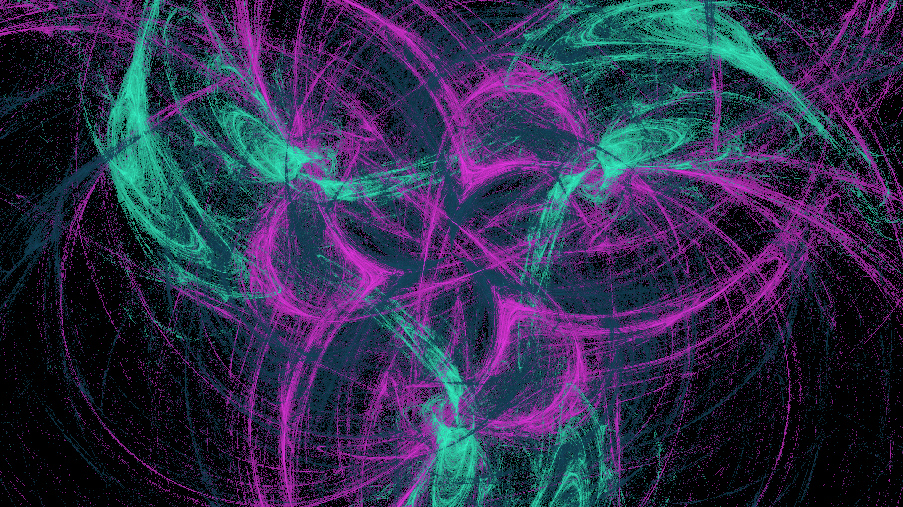

# Fractal Flame Generator

A high‑performance console application that generates **fractal flame** images using the Chaos Game algorithm.  
Supports both single‑threaded and multi‑threaded execution, multiple colouring, affine transformations, and a variety of non‑linear functions. Configuration can be provided via command‑line arguments or a JSON file.

## Features

- **Three input methods**: command‑line flags, JSON configuration file, or default values.
- **Multi‑threaded rendering** – significantly faster than single‑threaded on multi‑core systems.
- **Colour algorithm** – produces full 24‑bit RGB images (8 bits per channel).
- **Affine transformations** – define any number of affine coefficient sets (`a,b,c,d,e,f`).
- **Non‑linear functions** – at least four built‑in functions from the Fractal Flame paper (e.g., swirl, horseshoe, sinusoidal, spherical).
- **Progress logging** – shows the percentage of work completed without flooding the console.
- **PNG output** – saves the final image as a standard PNG file.
- **Validation** – all input parameters are validated; clear error messages are displayed.